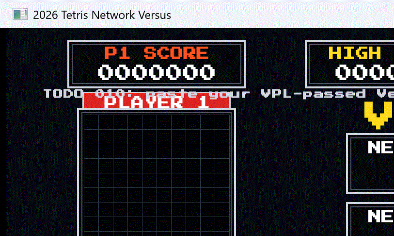

# 2026 C++ Tetris 009/010 VSCode Network Client


PNU C++ 2026 테트리스 학생 배포 과제 009/010을 VPL에서 통과한 뒤 실제 Vultr 서버에 접속해 테스트하기 위한 VSCode/CMake 프로젝트입니다.

이 저장소는 정답 저장소가 아닙니다. 아래 학생 구현 파일은 컴파일용 TODO 스텁으로 남겨 두었습니다. 학생은 본인이 VPL에서 통과시킨 구현을 붙여 넣은 뒤 서버에 접속해서 화면 테스트를 합니다.

| 학생 배포 과제 | 내부 디렉터리 | 학생 구현 파일 |
|---|---|---|
| 009 | `assignments/010_server_client` | `client/RemoteRenderMapper.cpp` |
| 009 | `assignments/010_server_client` | `client/NetworkGameApp.cpp` |
| 010 | `assignments/011_network_versus` | `core/TetrominoPreview.cpp` |
| 010 | `assignments/011_network_versus` | `client/VersusViewMapper.cpp` |

제공 코드에는 SFML TCP transport, 프로토콜/전송 계층, 학생 과제 009용 bot/SFML client와 학생 과제 010용 대전 view client가 포함됩니다. 내부 디렉터리 이름은 기존 빌드 번호를 따라 010/011로 유지되어 있습니다.

## 학생 과제 010 / 내부 011 Network Versus 클라이언트

`assignments/011_network_versus/`에 **내 보드와 상대 보드를 한 화면에 보여 주는
대전 클라이언트** 2종이 추가되었습니다. 학생 과제 009(내부 010) 쪽 파일·빌드 타깃은 그대로이므로
기존 작업에는 영향이 없습니다 — `git pull` 후 다시 빌드만 하면 됩니다.
서버 접속용 클라이언트와 렌더러는 제공 코드입니다. 학생 과제 010에서 구현 대상인 mapper 파일은 위 표의 `TetrominoPreview.cpp`, `VersusViewMapper.cpp`입니다.



위 미리보기는 학생 과제 010 대전 클라이언트(`tetris011_sfml_versus_client`)가 이 배포본에서 빌드되어 실행되는 화면입니다. 학생 구현 파일을 VPL 통과 코드로 교체하면 서버의 `VERSUS_SNAPSHOT`을 받아 양쪽 보드, 점수, 다음 블록, Top 5 패널이 채워집니다.

| 타깃 | 설명 |
|---|---|
| `tetris011_sfml_versus_client` | SFML 그래픽 대전 클라이언트 (기본 빌드에 포함) |
| `tetris011_ncurses_versus_client` | 터미널(ncurses) 대전 클라이언트 — 옵션 빌드, Linux/macOS |

```bash
# SFML 대전 클라이언트 (기본 멀티 대기열: 다른 학생과 매칭, 5초 내 상대가 없으면 서버 AI 투입)
./build/default/assignments/011_network_versus/tetris011_sfml_versus_client \
  --host tetris.leafmill.com --port 27015 \
  --name 본인이름 --section 062

# 서버 AI와 바로 1:1 대결 (--ai-level 1|2|3)
./build/default/assignments/011_network_versus/tetris011_sfml_versus_client \
  --host tetris.leafmill.com --port 27015 \
  --name 본인이름 --section 062 --solo --ai-level 2
```

ncurses 버전은 curses 헤더가 필요하며(`sudo apt install -y libncurses-dev`)
아래처럼 옵션을 켜고 다시 빌드합니다.

```bash
cmake --preset default -DBUILD_NCURSES_VERSUS_CLIENT=ON
cmake --build build/default --parallel
./build/default/assignments/011_network_versus/tetris011_ncurses_versus_client \
  --host tetris.leafmill.com --port 27015 --name 본인이름 --section 062 --solo
```

조작키는 동일합니다: ← → 이동, ↓ 소프트드롭, ↑ 회전, Space 하드드롭, Q/Esc 종료.
옵션도 학생 과제 009용 SFML 클라이언트와 동일합니다 (`--section 061|062`, `--ai-level 1|2|3`,
`--solo`/`--mode multi`, SFML은 `--font`). 서버 주소 `tetris.leafmill.com`은
기존 IP `158.247.241.98`과 같은 서버입니다.

## Quick Start

```bash
git clone https://github.com/kaper-edward/2026_tetris_010_only_vscode.git
cd 2026_tetris_010_only_vscode
cmake --preset default
cmake --build build/default --parallel
```

빌드 후 실행 파일은 아래 위치에 생성됩니다.

```text
build/default/assignments/010_server_client/tetris_client_bot
build/default/assignments/010_server_client/tetris010_sfml_client
```

## Server Smoke Test

`tetris_client_bot`은 TODO 스텁과 무관하게 SFML Network 연결, WELCOME, 매칭, snapshot 수신을 확인하는 용도입니다.

수업 서버는 Top20을 분반별로 집계합니다. `062` 분반은 기본값이므로 생략해도 되지만, 명령에 명시하는 것을 권장합니다. `061` 분반 학생은 반드시 `--section 061`을 붙여야 합니다. server bot 난이도는 `--ai-level 1|2|3`으로 선택하고, 생략하면 Lv1입니다.

```bash
./build/default/assignments/010_server_client/tetris_client_bot \
  --host 158.247.241.98 \
  --port 27015 \
  --name bot010 \
  --section 062 \
  --ai-level 1 \
  --timeout-ms 15000
```

무제한으로 실행하려면 `--timeout-ms 0`을 사용합니다.

```bash
./build/default/assignments/010_server_client/tetris_client_bot \
  --host 158.247.241.98 \
  --port 27015 \
  --name bot010 \
  --section 062 \
  --ai-level 1 \
  --timeout-ms 0
```

## 학생 과제 009 / 내부 010 SFML Client

학생 과제 009 VPL 통과 후 `RemoteRenderMapper.cpp`, `NetworkGameApp.cpp`를 본인 구현으로 교체하고 실행합니다.

```bash
./build/default/assignments/010_server_client/tetris010_sfml_client \
  --host 158.247.241.98 \
  --port 27015 \
  --name student010 \
  --section 062 \
  --ai-level 2 \
  --mode solo
```

멀티 대기열로 접속하려면 `--mode multi`를 사용합니다.

```bash
./build/default/assignments/010_server_client/tetris010_sfml_client \
  --host 158.247.241.98 \
  --port 27015 \
  --name student010 \
  --section 062 \
  --ai-level 2 \
  --mode multi
```

`061` 분반 학생은 위 예시의 `--section 062`를 `--section 061`로 바꾸면 됩니다. 분반 값을 잘못 보내면 서버가 `ERROR code=bad_section`으로 거부합니다.

## SFML

`cmake/SfmlSetup.cmake`는 system SFML 3.x가 있으면 먼저 사용하고, 없으면 SFML 3.1.0을 GitHub에서 받아 빌드합니다. SFML Network가 필요하므로 Linux에서는 보통 아래 패키지가 필요합니다.

```bash
sudo apt update
sudo apt install -y cmake g++ ninja-build libx11-dev libxrandr-dev libxcursor-dev libxi-dev libudev-dev libgl1-mesa-dev libflac-dev libvorbis-dev libopenal-dev libmbedtls-dev libssh2-1-dev
```

## Repository Layout

```text
.
├── CMakeLists.txt
├── CMakePresets.json
├── .vscode/
├── cmake/SfmlSetup.cmake
├── docs/
├── scripts/self_test.sh
├── support/
└── assignments/
    ├── 010_server_client/      # 학생 배포 과제 009
    └── 011_network_versus/     # 학생 배포 과제 010
```

`support/`에는 서버 클라이언트를 빌드하기 위한 protocol, transport, renderer 지원 코드가 들어 있습니다. 학생이 서버 테스트를 위해 수정해야 하는 파일은 위 표의 학생 구현 파일뿐입니다.
